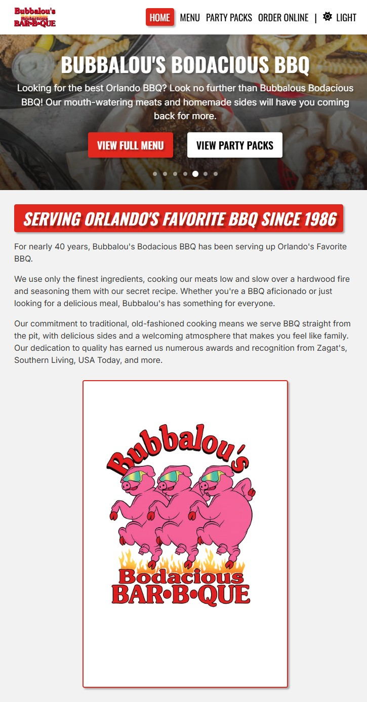
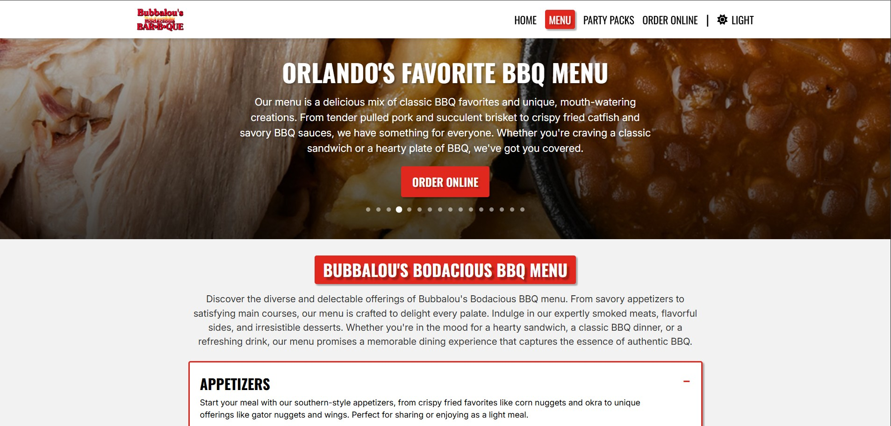
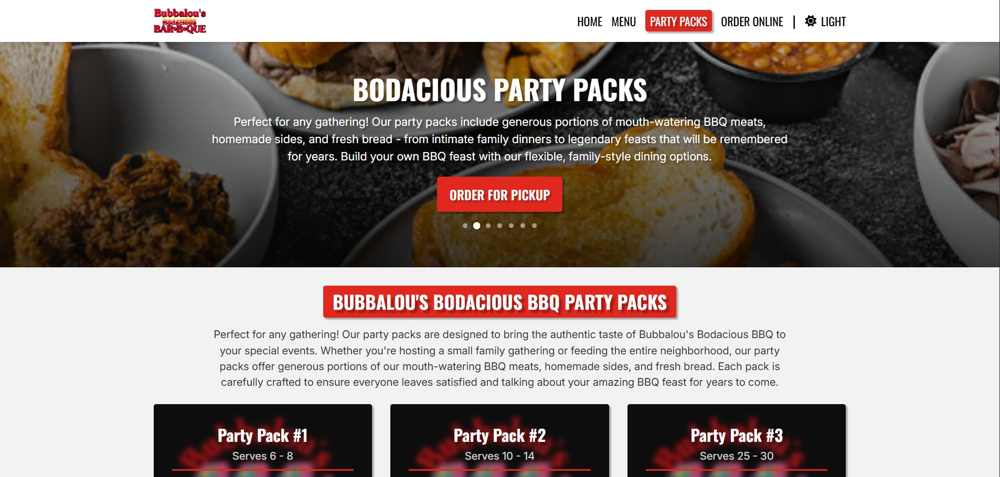
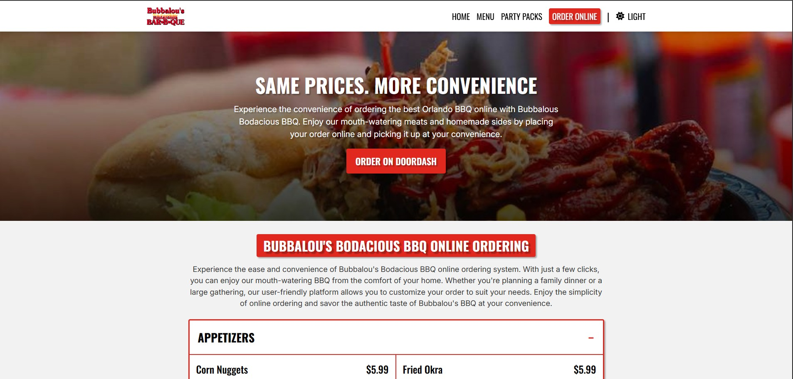
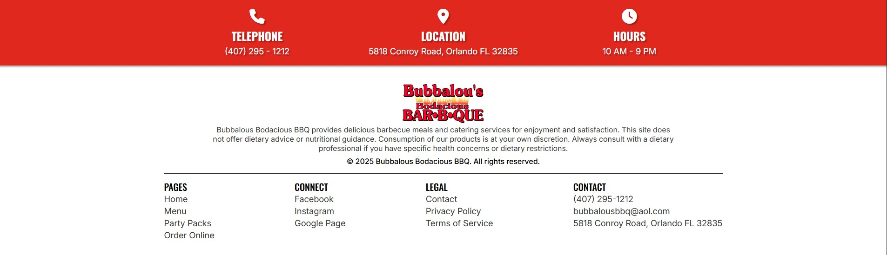
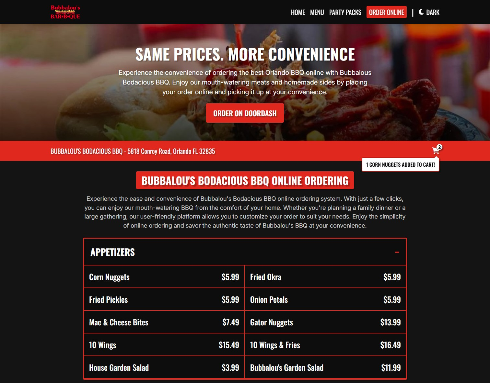

# Bubbalous Bodacious BBQ

## Project Summary

Bubbalous Bodacious BBQ is a modern, responsive restaurant website showcasing Orlando's favorite BBQ establishment since 1986. This comprehensive web application provides customers with an immersive digital experience that reflects the authentic, family-owned restaurant's commitment to traditional BBQ excellence and community service.

The project addresses the need for restaurants to establish a strong online presence in today's digital landscape. With the rise of online ordering, mobile browsing, and social media engagement, restaurants require websites that not only showcase their menu and services but also provide seamless user experiences across all devices. This application solves the challenge of creating a professional, accessible, and engaging online platform that captures the essence of a beloved local BBQ restaurant while meeting modern web standards and user expectations.

Built with React, Vite, and modern web technologies, the application features a complete menu system with comprehensive categories including appetizers, sandwiches, dinners, combos, and party packs. The site includes interactive elements such as a dynamic image carousel on the homepage, dark/light theme switching for enhanced user experience, and a mobile-responsive design that ensures optimal viewing across all devices. The application also incorporates security features like CAPTCHA verification for contact forms, ensuring protection against automated spam while maintaining accessibility for legitimate users.

## Table of Contents

- [Usage](#usage)
- [Mock-Up](#mock-up)
- [Instructions](#instructions)
- [Key Features](#key-features)
- [Technology Stack](#technology-stack)

## Usage

To start the application, run the following commands:

#### 1. Install Dependencies

```bash
npm install
```

#### 2. Run The Development Server

```bash
npm run dev
```

#### 3. Build For Production

```bash
npm run build
```

#### 4. Preview Production Build

```bash
npm run preview
```

## Mock-Up

The following images show the web application's appearance and functionality:













## Instructions

To use this application, follow these simple steps:

### 1. Clone The Repository

- Download or clone the project to your local machine.

### 2. Install Dependencies

- Run `npm install` in the project root to install all required packages.

### 3. Start The Development Server

- Run `npm run dev` and open the provided local URL in your browser to view the application.

### 4. Build and Deploy

This project can be deployed to platforms like Vercel, Netlify, or any static hosting service:

- Run `npm run build` to generate a production build.
- Deploy the contents of the dist folder to your preferred static hosting service.

## Key Features

- **Dynamic Image Carousel:** Auto-rotating banner images showcasing delicious BBQ dishes with manual navigation controls and smooth transitions.

- **Legal Compliance Pages:** Complete Privacy Policy and Terms of Service pages ensuring regulatory compliance and transparency for business operations.

- **Accessibility Features:** Semantic HTML structure, ARIA labels, keyboard navigation support, and high contrast theme options for inclusive user experience.

- **Theme Toggle System:** Seamless dark/light mode switching with persistent user preferences stored in localStorage and automatic system preference detection.

- **Party Pack Ordering:** Specialized section for catering and large group orders with detailed package information, serving sizes, and pricing for events of various scales.

- **Performance Optimized:** Fast loading times through Vite bundling, efficient image formats (AVIF), and optimized component rendering for superior user experience.

- **Mobile-First Responsive Design:** Optimized layouts for all screen sizes with a collapsible mobile navigation menu featuring smooth animations and intuitive touch interactions.

- **Interactive Contact Form:** Secure contact system with CAPTCHA verification to prevent spam while maintaining accessibility, featuring email integration for direct communication.

- **Comprehensive Menu System:** Complete menu with categorized sections including appetizers, sandwiches, dinners, combos, and by-the-pound options, all managed through structured JSON data.

## Technology Stack

- **Local Storage API:** Client-side data persistence for user preferences and theme settings without server dependencies.

- **CSS Modules:** Scoped styling system preventing style conflicts while maintaining modular, maintainable CSS architecture.

- **React 19:** Modern component-based UI library for building interactive user interfaces with hooks and functional components.

- **CSS Custom Properties:** Dynamic theming system enabling real-time theme switching and consistent design token management.

- **Vite:** Lightning-fast build tool and development server providing instant hot module replacement and optimized production builds.

- **JavaScript ES6+:** Modern JavaScript features including destructuring, arrow functions, and template literals for clean, readable code.

- **Responsive Design:** Mobile-first approach using CSS Grid, Flexbox, and media queries for optimal viewing across all devices and screen sizes.

- **React Router DOM:** Client-side routing solution enabling single-page application navigation with dynamic page titles and URL management.

- **JSON Data Management:** Structured data storage for menu items, party packs, and restaurant information enabling easy content updates and maintenance.
